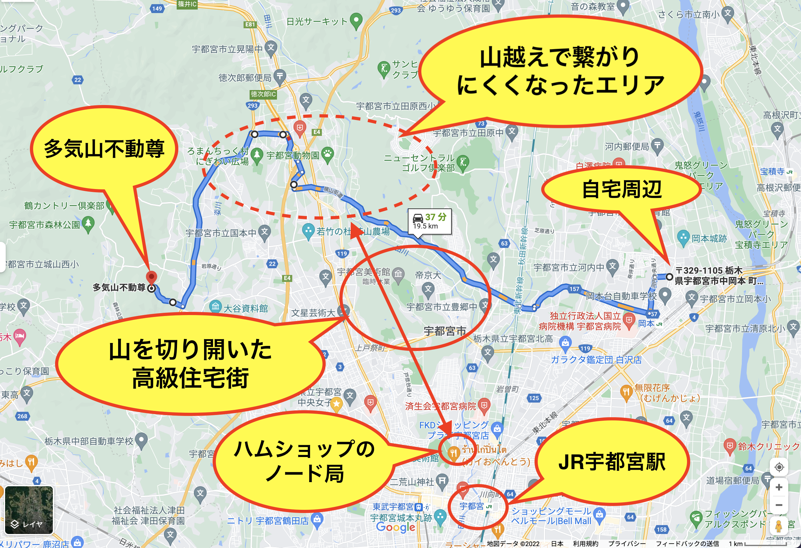

# tage

<html>
<head>

<html lang="ja">
 <head>
  <meta charset="utf-8" />
 

<link href="https://cdnjs.cloudflare.com/ajax/libs/lightbox2/2.7.1/css/lightbox.css" rel="stylesheet">

</head>

<body>

モバイル端末をお使いの場合は、画面を横向きにすると
より見やすくご覧頂けます。

<!--ここ上は、ほぼそのまま使います！-->

<!--QRコードの挿入例-->
 <!--

 アクセス用QRコード
-->

<marquee direction="left" scrollamount="20" width="30%">(^_^)/~hada</marquee>

<!--流れ文字の挿入例-->
<h1><marquee behavior="alternate">!!! 2022/01/15 多気山お参り !!!</marquee></h1>

<!--ここから下が、本体部分-->
 <!--
 
じゅりちゃんの50Freeから、赤羽さんの200Freeまで、 気がついたものだけ動画撮りました。 撮り逃してたら、ごめんなさいです m(_ _)m 
動画は全て限定公開状態ですので、検索しても出て来ません。 このリンクからしか見えませんのでご安心を。
-->

                            

  
多気山に向かう道の前には、冬の男体山が見事に見えました。

多気不動尊に到着。

コロナ対策で柄杓が無くなった、お清めの水。

境内の麓にも、お参りポイントが有ります。

この長い階段を登って、お参りです。

階段の途中で垣間見えた、中腹の水子地蔵尊。 斜面全体が不動尊の境内になっていて、谷の向こうに下りの通路が見えます。

階段を登りきって、下を振り返ったところ。 よく登りました。

境内の淵から、下界が見渡せます。

下に見える道の辺りで、門さんとの通信が復帰しました。

多気不動尊です。

背景にもなっている、不動尊とお地蔵さん。

こちらにもお賽銭を入れて、鐘をつきます。

下り道の途中に、山頂への分岐点。

寒いので今回はパスでした。

階段の途中から見えた、水子地蔵。

<!--
-->

あどけなさが表現されたお顔です。

下り道の途中にも、不動尊が点在。

お守りの授与所も開設されていました。

存在感の際立つ仏像様。

不動尊の修行僧や職員たちの宿泊施設でしょうか。

厄年の年齢が、神社と一年ずれていました。

最後になりましたが、門さんと交信しながら通ったルート。 途中の通信困難エリアがノード局との山越えになっているのがわかります。

<!--本体はここまで-->

<!--画面に空白地帯を作って、背景が見えるようにしています-->
                                              

<!-- フッタ -->
<footer>
Copyright 2022/01/15 S.Hada
</footer>

<!--HPにさまざまなJavaScriptを呼び込むための書式-->

</body>

</html>
